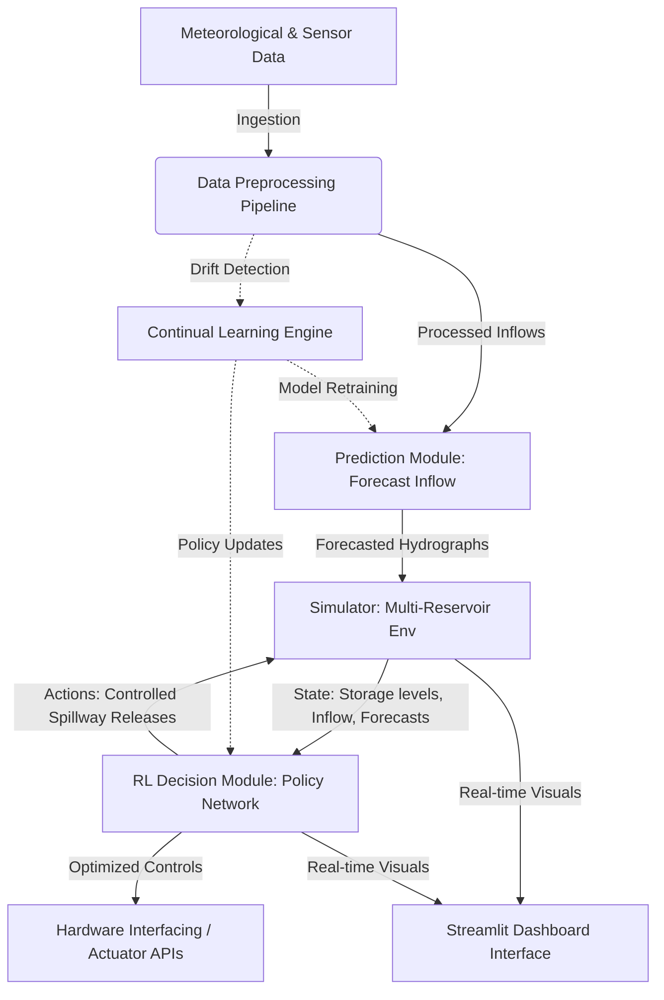

# AI-Based Multi-Reservoir Water Management and Flood Prevention System

An advanced, research-grade framework designed to optimize water distribution, manage reservoir levels, and prevent downstream flooding across a network of interconnected reservoirs. The system integrates predictive inflow models, a custom multi-reservoir simulator, reinforcement learning control agents, and continual learning mechanisms.

---

## Motivation

As climate change accentuates weather volatility, extreme precipitation events and severe droughts are becoming more frequent. Traditional reservoir operations rely heavily on rule curves and historical averages, which are increasingly inadequate for handling modern hydrological anomalies. 

This project aims to bridge the gap by combining predictive artificial intelligence with intelligent decision-making control systems. By forecasting streamflows and optimizing release policies in real-time, the system maximizes water preservation for irrigation and municipal use while minimizing downstream flood risks.

---

## Objectives

1. **Hydrological Forecasting**: Develop highly accurate deep learning-based inflow forecasting models using multi-modal meteorological data.
2. **Dynamic Simulation**: Build a modular, physical simulator modeling cascading reservoir networks with mass-balance constraints.
3. **Optimized Control (RL)**: Train reinforcement learning agents to make safe, optimal release decisions under diverse and extreme weather conditions.
4. **Adaptive Lifelong Learning**: Implement continual learning wrappers to adapt the forecasting and decision engines to concept drift and long-term climatic shifts.
5. **Human-in-the-Loop Supervision**: Provide an interactive operator dashboard showing forecasting uncertainties, simulation states, and recommended actions.

---

## System Architecture



---

## Technology Stack

*   **Core Programming**: Python 3.10+
*   **Data Processing & Engineering**: `numpy`, `pandas`, `scikit-learn`
*   **Graph/Network Modeling**: `networkx` (for cascading reservoir connectivity)
*   **Interactive Visualization**: `plotly`, `matplotlib`
*   **Operator Dashboard**: `streamlit`
*   **Workflow & Prototyping**: `jupyter`
*   *Note: Deep learning frameworks (e.g., PyTorch) and reinforcement learning toolkits (e.g., Gymnasium, Stable-Baselines3) will be integrated in subsequent phases.*

---

## Project Structure

```text
AI-Based-Multi-Reservoir-Water-Management/
├── data/
│   ├── raw/                 # Raw hydrological and meteorological datasets
│   ├── processed/           # Processed and normalized feature arrays
│   └── external/            # External files (weather forecasts, river basin GIS data)
│
├── notebooks/               # Jupyter notebooks for EDA and model exploration
│
├── src/                     # Production-grade Python source files
│   ├── prediction/          # Inflow forecasting and predictive models
│   ├── simulator/           # Water dynamics simulation environment
│   ├── rl/                  # Reinforcement Learning agents and policy networks
│   ├── continual_learning/  # Concept drift adaptation and continual training scripts
│   ├── hardware/            # IoT integration and telemetry mock APIs
│   └── dashboard/           # Streamlit operator dashboard application
│
├── docs/                    # Weekly progress, roadmap, and project resources
│   ├── Week-1.md            # Week-by-week development logs
│   ├── Resources.md         # Scholarly articles, datasets, and reference links
│   └── ProjectRoadmap.md    # 7-Month milestones and Gantt timeline
│
├── images/                  # Architecture diagrams and visualization assets
│
├── results/                 # Metrics, trained models, performance logs, and plots
│
├── requirements.txt         # Lightweight project dependencies
├── LICENSE                  # Project license (MIT)
└── README.md                # Project landing page (this file)
```

---

## Development Roadmap

The project is structured as a 7-month development timeline:
*   **Month 1**: Literature Review & Architecture Design (Current Phase)
*   **Month 2**: Data Acquisition & Preprocessing Pipeline
*   **Month 3**: Inflow Forecasting Model Development
*   **Month 4**: Reservoir Simulator Environment Design (Gymnasium wrapper)
*   **Month 5**: Reinforcement Learning (RL) Control Optimization
*   **Month 6**: Continual Learning & Dashboard Integration
*   **Month 7**: System Integration, Validation, and Thesis Compilation

For detailed milestones and the task list, refer to the [ProjectRoadmap.md](docs/ProjectRoadmap.md).

---

## Team Roles (Placeholder)

*   **Team Member 1**: Machine Learning Engineer (Prediction & Continual Learning focus)
*   **Team Member 2**: Simulation & Control Specialist (Simulator & RL Environment focus)
*   **Team Member 3**: System Architect & Dashboard Developer (Ingestion, Dashboards, & Hardware APIs focus)

---

## Future Work

*   **Multi-Agent Coordination**: Decoupling control so each reservoir has its own agent cooperating with neighbors.
*   **Extreme Climate Simulation**: Stress testing the algorithms against historical worst-case droughts and catastrophic storm models.
*   **Edge Telemetry**: Deploying lightweight policy models onto edge microcontrollers to run offline on-site.

---

## References (Placeholder)

*   *Sutcliffe, J. V., & Parks, Y. P. (1999). The Hydrology of the Nile. IAHS Special Publication.*
*   *Sutton, R. S., & Barto, A. G. (2018). Reinforcement Learning: An Introduction. MIT Press.*
*   [USGS Hydrological Data Archives](https://waterdata.usgs.gov/)

---

## License

This project is licensed under the MIT License - see the [LICENSE](LICENSE) file for details.
