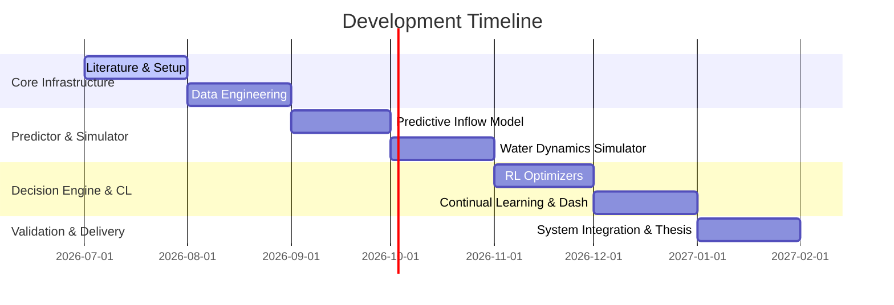

# 7-Month Development Roadmap & Milestones

This document details the monthly timeline, objectives, and deliverables for the AI-Based Multi-Reservoir Water Management and Flood Prevention System.

---

## Month 1: Literature Review, Architecture, and Setup
*   **Goal**: Establish a solid theoretical foundation and set up workspace frameworks.
*   **Tasks**:
    *   [ ] Read and synthesize research on Deep Reinforcement Learning for reservoir management.
    *   [ ] Formulate the mathematical model (e.g., Markov Decision Process) for the reservoirs.
    *   [ ] Draw and verify the high-level system architecture.
*   **Milestone 1**: Approved System Design document and completed Literature Review summary.

## Month 2: Data Acquisition and Preprocessing Pipeline
*   **Goal**: Gather historical rainfall, inflow, outflow, and reservoir storage data.
*   **Tasks**:
    *   [ ] Download data from USGS/NASA or regional irrigation boards into `data/raw/`.
    *   [ ] Perform Exploratory Data Analysis (EDA) in Jupyter Notebooks.
    *   [ ] Write modular scripts to clean, normalize, and format the data in `data/processed/`.
*   **Milestone 2**: Operational data ingestion and preprocessing pipeline.

## Month 3: Inflow Forecasting & Predictor Model Development
*   **Goal**: Build an AI model to forecast reservoir inflows based on rainfall and history.
*   **Tasks**:
    *   [ ] Implement baseline models (e.g., historical averaging, linear regression) and advanced models (e.g., LSTMs, Transformers).
    *   [ ] Train and validate inflow predictions on the historical data.
    *   [ ] Save trained weights and evaluation graphs in `results/`.
*   **Milestone 3**: Inflow forecasting system with mean absolute error (MAE) below target threshold.

## Month 4: Reservoir Simulator Environment Design
*   **Goal**: Build a physical simulation of the multi-reservoir system to act as the RL environment.
*   **Tasks**:
    *   [ ] Define mass balance equations (Inflow - Outflow - Evaporation/Spill = Change in Storage).
    *   [ ] Model the cascade relationship (release from Reservoir A flows into Reservoir B).
    *   [ ] Create a Gymnasium-compatible custom environment wrapping the simulator.
*   **Milestone 4**: Interactive, fully-tested multi-reservoir simulator environment.

## Month 5: Reinforcement Learning (RL) Control Optimization
*   **Goal**: Train RL agents to make optimal daily or hourly release decisions.
*   **Tasks**:
    *   [ ] Formulate multi-objective reward functions (flood prevention, hydropower generation, irrigation needs).
    *   [ ] Train algorithms (e.g., PPO, SAC) in the simulator.
    *   [ ] Compare RL policies against standard heuristic policies (e.g., rule curves).
*   **Milestone 5**: Coordinated RL control policy demonstrating improved flood mitigation over rule curves.

## Month 6: Continual Learning & Dashboard Integration
*   **Goal**: Address seasonal shifts/climate drift and build the user interface.
*   **Tasks**:
    *   [ ] Implement a drift detection and continual learning mechanism (e.g., experience replay) in `continual_learning/`.
    *   [ ] Design a Streamlit-based dashboard to visualize reservoir levels, forecasts, and RL decisions.
    *   [ ] Connect the simulation engine to the dashboard.
*   **Milestone 6**: Complete system integration with an interactive operator dashboard interface.

## Month 7: Validation, Hardware Mocking, and Thesis Compilation
*   **Goal**: Run end-to-end evaluation, mock hardware deployment, and compile the final report.
*   **Tasks**:
    *   [ ] Run stress-test scenarios (e.g., 50-year storm event) to validate system safety.
    *   [ ] Mock telemetry/actuator commands in `hardware/` (e.g., via MQTT/JSON API).
    *   [ ] Compile experimental results, generate final figures, and write the thesis/report.
*   **Milestone 7**: Final system deployment, thesis submission, and project presentation.
