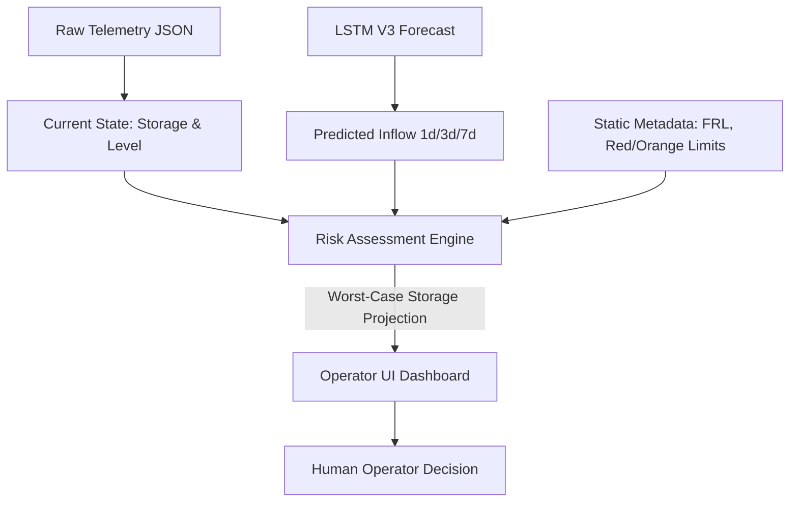

# Phase 14 Step 0: Reservoir Management & Flood Prevention Audit

## 1. Executive Summary

This forensic audit evaluates the readiness of the project repository to support an operational reservoir management and flood-prevention system. Based on a strict review of existing verified artifacts, the repository contains robust historical telemetry (water levels, storage, release, inflow) and static metadata (warning thresholds, full reservoir levels) for the primary dams. The LSTM V3 model successfully provides multi-horizon inflow volume forecasts.

However, the repository completely lacks downstream routing physics, agricultural irrigation demand profiles, hydropower grid demands, and automated release policies (reinforcement learning or heuristic). Therefore, fully autonomous dam control is not scientifically defensible. The recommended path forward is to build an **Operator Decision Support Dashboard** that pairs live telemetry with the V3 inflow forecast to project "worst-case / zero-release" threshold violations, functioning as an early-warning flood prevention tool rather than an autonomous controller.

## 2. Verified Available Management Data

The following table categorizes the information discovered during the repository audit:

| Information | Available? | Exact source file | Coverage | Units | Time period | Reliability / Caveat |
| :--- | :--- | :--- | :--- | :--- | :--- | :--- |
| **Reservoir Identities** | YES | `data/raw/reservoir/Kerala-Dam-Water-Levels/live.json` | 16 KSEB, 20 Irrigation | N/A | Static | Verified |
| **Capacities / FRL** | YES | `live.json`, `irrigation_live.json` | All logged dams | MCM / Meters | Static | Verified |
| **Current / Storage Levels** | YES | `historic_data/*.json` | Daily records | MCM / % | Aug 2020 - Jul 2026 | Verified, gaps exist |
| **Inflow Measurements** | YES | `historic_data/*.json` | Daily records | MCM / Cumecs | Aug 2020 - Jul 2026 | Verified |
| **Outflow / Release** | YES | `historic_data/*.json` | Powerhouse & Spillway | MCM / Cumecs | Aug 2020 - Jul 2026 | Verified |
| **Warning / Flood Levels** | YES | `live.json` | Blue, Orange, Red | Meters / MCM | Static | Verified |
| **Rainfall / Weather** | YES | `IMD_RF25_*.nc`, `historic_data/*.json` | Gridded + Point | mm | 2017 - 2026 | Verified |
| **Rule Curves** | PARTIAL | `live.json` | Single `ruleLevel` scalar | Meters | Static | A dynamic monthly rule curve is missing. |

## 3. Missing Management Data

The following necessary components for autonomous management are strictly **NOT AVAILABLE** in the repository:
- **Irrigation Requirements**: No crop demand or seasonal agricultural release profiles.
- **Hydropower Requirements**: No power grid demand curves.
- **Minimum Drawdown Level (MDDL)**: Not explicitly defined in the metadata.
- **Downstream River Routing / Channel Capacities**: No data on how much water the downstream river can safely carry before flooding human settlements.
- **Implemented Control Code**: `src/simulator/`, `src/rl/`, `src/dashboard/`, and `src/hardware/` exist only as empty `.gitkeep` directories.

## 4. V3 Forecast Capabilities

The frozen `LSTM V3 (Log1p Target)` model provides the following:
- **Outputs**: Multi-horizon predictions of future incoming water volume (1-day, 3-day, and 7-day).
- **Format**: Per-reservoir predictions in original inflow units, completely aligned with the test dates (2025).
- **Crucial Distinction**: V3 strictly predicts **inflow** (water entering the dam). It does **not** predict water level, storage, or required release, as those depend on human operational decisions.

## 5. What Management Decisions Are Currently Defensible

Based strictly on verified evidence, the following management layer features are feasible:

- **READY**:
  - *High-inflow warning*: V3 natively outputs this.
  - *Operator dashboard*: The raw telemetry and V3 forecast can be immediately visualized.
- **POSSIBLE WITH DERIVED VARIABLES**:
  - *Flood-risk / Emergency warning*: We can calculate a "Zero-Release Worst-Case Trajectory" by adding the V3 predicted inflow volume to the current telemetry storage. If this sum exceeds the verified `redLevel` or `FRL`, a flood risk warning is triggered.
  - *Reservoir-level risk*: (Same as above).
- **NOT DEFENSIBLE WITH CURRENT DATA**:
  - *Release recommendation*: We do not have downstream flood capacities or a trained RL agent.
  - *Irrigation/Hydropower optimization*: We lack the demand side of the equation.
  - *Multi-reservoir coordination*: The GNN research branch failed; spatial coordination must be heuristic, not model-driven.

## 6. What Cannot Currently Be Claimed

To maintain academic and scientific integrity, the thesis **must not claim**:
- "The AI automatically controls the dam gates."
- "The system optimizes water for irrigation and power generation."
- "The model uses Graph Neural Networks to route water between dams." (The GNNs failed and were abandoned).

## 7. Recommended Management-Layer Architecture

The most scientifically rigorous path forward is an **Early-Warning Decision Support Dashboard**.

## 8. Proposed Phase 14 Roadmap

1. **Phase 14.1 — Risk Interpretation Engine**: Develop a pure Python module that accepts current telemetry and V3 forecasts to calculate worst-case storage trajectories against the Blue/Orange/Red thresholds.
2. **Phase 14.2 — Dashboard Backend**: Build a lightweight API (e.g., FastAPI/Flask) to serve the telemetry, forecast, and risk assessments.
3. **Phase 14.3 — Dashboard UI**: Implement a frontend visualization (e.g., Streamlit) simulating an operator's control room.
4. **Phase 14.4 — Scenario Validation**: Demonstrate the dashboard using a critical historical window (e.g., the June 2025 structural discontinuity period) to prove its early-warning utility.

## 9. Risks and Limitations

- **Peak Dampening**: As identified in the V3 audit, the model under-predicts extreme peaks, particularly at 7 days. The Risk Interpretation Engine must account for this by providing conservative risk bands.
- **Static Rule Curves**: The lack of dynamic seasonal rule curves means risk assessments are strictly based on absolute physical limits (FRL / Red Level) rather than optimal seasonal operation.

## 10. Final Recommendation

**Do not attempt to build an autonomous reinforcement learning controller or optimization engine.** The data simply does not support it. Instead, focus entirely on building a high-quality, interactive visualization dashboard that translates the highly accurate 1-day V3 inflow forecasts into actionable early warnings for human dam operators. This perfectly fulfills the "Flood Prevention" aspect of the project title while respecting the limitations of the available dataset.
